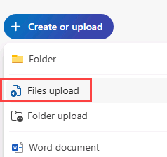
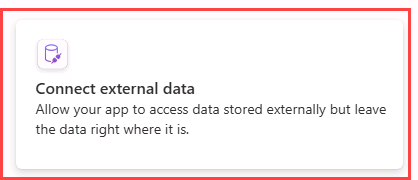
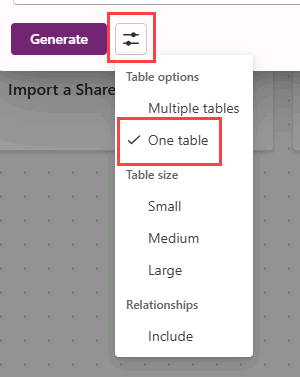

---
lab:
  title: "Labo\_1\_: Créer une application canevas à partir de données"
  module: 'Module 1: Get started with Power Apps canvas apps'
---

# Labo pratique 1 : Créer une application canevas à partir de données

Dans ce labo, vous allez concevoir et créer une application canevas à partir d’une source de données existante.

## Contenu du didacticiel

- Comment créer des applications canevas Power Apps à partir de données et avec CoPilot
- Comment se connecter à Excel en utilisant OneDrive Entreprise en tant que source de données

## Étapes de labo de haut niveau

- Créer une application canevas à partir de données
- Tester l'application
- Créer une application canevas avec CoPilot
  
## Prérequis

- Vous devez avoir effectué le **Labo 0 : Valider l’environnement de labo**

## Procédure détaillée

## Exercice 1 : Obtenir les données

### Tâche 1.1 : Télécharger la feuille de calcul Excel

1. Dans un navigateur web, accédez à [CoffeeMachineData.xlsx](https://github.com/MicrosoftLearning/PL-7001-Create-and-manage-canvas-apps-with-Power-Apps/blob/master/Allfiles/Labs/CoffeeMachineData.xlsx) à l’adresse `https://github.com/MicrosoftLearning/PL-7001-Create-and-manage-canvas-apps-with-Power-Apps/blob/master/Allfiles/Labs/CoffeeMachineData.xlsx`.

1. Sélectionnez le bouton de fichier **Brut** pour télécharger le classeur Excel.

    

### Tâche 1.2 : Charger sur OneDrive Entreprise

1. Dans le [portail Power Apps Maker](https://make.powerapps.com) sélectionnez le **lanceur d’applications** en haut à gauche de la fenêtre du navigateur, puis sélectionnez **OneDrive**.

    

1. Si une fenêtre contextuelle s’affiche, sélectionnez **Votre OneDrive est prêt**.

1. Sélectionnez **+Créer ou charger**, puis **Chargement de fichiers**.

    

1. Accédez au dossier **Téléchargements** et sélectionnez le fichier **CoffeeMachineData.xlsx**, puis **Ouvrir**.

1. Sélectionnez **Mes fichiers** et vérifiez que CoffeeMachineData.xlsx a bien été chargé.

## Exercice 2 : créer une application canevas à partir de données

### Tâche 2.1 : Créer l’application

1. Accédez au portail Power Apps Maker <https://make.powerapps.com>.

1. Vérifiez que vous êtes dans l’environnement **Dev One**.

1. Sélectionner l’onglet **+ Créer** dans le menu de gauche.

1. Sélectionnez la vignette **Démarrer avec les données** sous **Créer vos applications**.

    

1. Sélectionnez la vignette **Connecter des données externes** sous **Autres façons de commencer**.

    

1. Sélectionnez la vignette **À partir d’Excel** sous **Choisir un jeu de données pour démarrer**.

    

1. Une connexion **Excel Online (Entreprise)** est automatiquement créée après un court délai.

1. Développez **OneDrive Entreprise** sous **Sélectionner la table**.

1. Développez **OneDrive**.

1. Développez le fichier Excel **CoffeeMachineData.xlsx**.

1. Sélectionnez la table **CoffeeMachines**.

    

1. Sélectionnez **Créer une application**.

1. Si la boîte de dialogue contextuelle **Bienvenue dans Power Apps Studio** s’affiche, sélectionnez **Ne plus afficher ce message**, puis **Ignorer**.

1. Attendez que l’application soit générée.

    

1. Sélectionnez **Enregistrer** en haut à droite de Power Apps Studio, entrez `Coffee Machines App`, puis sélectionnez **Enregistrer**.

### Tâche 2.2 : Tester l’application

1. Sélectionnez l’icône **Afficher un aperçu de l’application (F5)** en haut à droite de Power Apps Studio.

1. Sélectionnez n’importe quel ordinateur dans la galerie. Cela affiche les détails de l’ordinateur dans le formulaire.

1. Sélectionnez l’icône **Modifier** en haut à droite de l’application.

1. Modifiez le **Prix de l’ordinateur**, puis sélectionnez l’icône de **coche** en haut à droite de l’application.

1. Sélectionnez l’icône **+Nouveau** en haut à gauche de l’application.

1. Entrez `abcde` comme ID de l’ordinateur.

1. Entrez `Demo Machine` pour **Nom de l’ordinateur**.

1. Entrez `999` pour **Prix de l’ordinateur**.

1. Sélectionnez l’icône de **coche** en haut à droite de l’application.

1. Sélectionnez **X** dans le coin supérieur droit pour arrêter l’aperçu.

1. Si la boîte de dialogue contextuelle **Le saviez-vous ?** s’affiche, sélectionnez **Ne plus afficher ce message**, puis **OK**.

1. Sélectionnez le bouton **<- Précédent** en haut à gauche de la barre de commandes, puis cliquez sur **Quitter** pour quitter l’application.

## Exercice 3 : Créer une application canevas avec Copilot

### Tâche 3.1 : Créer l’application

1. Accédez au portail de création Power Apps `https://make.powerapps.com`

1. Vérifiez que vous êtes dans l’environnement **Dev One**.

1. Sélectionner l’onglet **+ Créer** dans le menu de gauche.

1. Sélectionnez la vignette **Démarrer avec Copilot** sous **Créer vos applications**.

1. Sous **Prise en main de Copilot**, entrez `Assign coffee repairs to technicians per customer request`.

    

1. Sélectionnez l’icône **Options de table** et sélectionnez **Une table**.

    

1. Sélectionnez **Générer**.

    Copilot va commencer à créer une structure de tables pour servir de base à votre application.

    > **IMPORTANT :** Lors de l’utilisation de l’IA générative, vous n’obtiendrez pas toujours exactement les mêmes résultats. Il est possible que votre table ne corresponde pas exactement à la table créée pour un autre étudiant.

1. Sélectionnez les **commandes (...)** en regard de la table, puis sélectionnez **Afficher les données**.

    

1. Consultez le tableau

    

1. Une fois que vous êtes satisfait de votre table, sélectionnez le bouton **Enregistrer et ouvrir l’application**.

1. Si nécessaire, sur l’écran **Terminé ?**, sélectionnez **Ne plus me demander**, puis sélectionnez le bouton **Enregistrer et ouvrir l’application**.

1. Attendez que l’application soit générée.

    

1. Sélectionnez **Enregistrer** en haut à droite de Power Apps Studio, entrez `Coffee Machine Repairs App`, puis sélectionnez **Enregistrer**.

1. Sélectionnez le bouton **<- Précédent** en haut à gauche de la barre de commandes, puis cliquez sur **Quitter** pour quitter l’application.

1. Sélectionnez l’onglet **Applications** dans le menu de gauche du portail Power Apps Maker.
