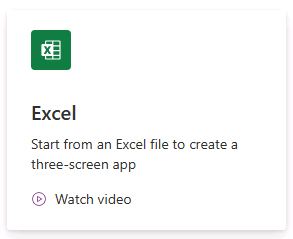

---
lab:
  title: "Labo\_1\_: Créer une application canevas à partir de données"
  module: 'Module 1: Get started with Power Apps canvas apps'
---

# Labo pratique 1 : Créer une application canevas à partir de données

Dans ce labo, vous allez concevoir et créer une application canevas à partir d’une source de données existante.

## Contenu du didacticiel

- Comment créer des applications canevas Power Apps à partir de données et avec CoPilot
- Comment se connecter à Excel en utilisant OneDrive Entreprise en tant que source de données

## Étapes de labo de haut niveau

- Créer une application canevas à trois écrans
- Tester l'application
- Créer une application canevas avec CoPilot
  
## Prérequis

- Vous devez avoir effectué le **Labo 0 : Valider l’environnement de labo**

## Procédure détaillée

## Exercice 1 : Obtenir les données

### Tâche 1.1 : Télécharger la feuille de calcul Excel

1. Accédez à [CoffeeMachineData.xlsx](https://github.com/MicrosoftDocs/mslearn-developer-tools-power-platform/blob/master/power-apps/coffee-machine-data/CoffeeMachineData.xlsx).

1. Sélectionnez le bouton de fichier **Brut** pour télécharger le classeur Excel.

    

### Tâche 1.2 : Charger sur OneDrive Entreprise

1. Dans le [portail Power Apps Maker](https://make.powerapps.com) sélectionnez le **lanceur d’applications** en haut à gauche de la fenêtre du navigateur, puis sélectionnez **OneDrive**.

    

1. Sélectionnez **Votre OneDrive est prêt**.

1. Sélectionnez **+ Ajouter nouveau**, puis sélectionnez **Chargement de fichiers**

    

1. Accédez aux téléchargements et sélectionnez le fichier CoffeeMachineData.xlsx, puis sélectionnez **Ouvrir**.

1. Sélectionnez **Mes fichiers** et vérifiez que CoffeeMachineData.xlsx a bien été chargé.

## Exercice 2 : Créer une application canevas à trois écrans

### Tâche 2.1 : Créer l’application

1. Accédez au portail Power Apps Maker <https://make.powerapps.com>.

1. Vérifiez que vous êtes dans l’environnement **Dev One**.

1. Sélectionner l’onglet **+ Créer** dans le menu de gauche.

1. Sélectionnez la vignette **Excel** sous **Démarrer à partir de**.

    

1. Sélectionnez **+ Nouvelle connexion**

1. Sélectionnez **OneDrive Entreprise**, sélectionnez **Créer**, connectez-vous avec vos informations d’identification de locataire, puis sélectionnez **Autoriser l’accès**.

1. Sous Choisir un fichier Excel, recherchez et sélectionnez le fichier Excel **CoffeeMachineData.xlsx**.

1. Sous Choisir un tableau, sélectionnez **CoffeeMachines**.

1. Sélectionnez **Se connecter**.

1. Attendez que l’application soit générée.

    

1. Si la boîte de dialogue **Bienvenue dans Power Apps Studio** s’affiche, sélectionnez **Ne plus afficher ce message** et sélectionnez **Ignorer**.

1. Sélectionnez **Enregistrer** en haut à droite de Power Apps Studio, entrez `Coffee Machines App`, puis sélectionnez **Enregistrer**.

### Tâche 2.2 : Tester l’application

1. Sélectionnez l’icône **Afficher un aperçu de l’application** en haut à droite de Power Apps Studio.

1. Sélectionnez n’importe quel ordinateur dans la galerie. Cette opération affiche l’écran Détails,

1. Sélectionnez l’icône **Modifier** en haut à droite de l’application. Cette opération ouvre l’écran Modifier.

1. Modifiez le **Prix de l’ordinateur**, puis sélectionnez l’icône de cycle **Envoyer l’élément** en haut à droite de l’application.

1. Sélectionnez l’icône **<** en haut à gauche de l’application.

1. Sélectionnez l’icône **+** en haut à droite de l’application.

1. Entrez `97` pour **ID de l’ordinateur**.

1. Entrez `Demo Machine` pour **Nom de l’ordinateur**.

1. Entrez `999` pour **Prix de l’ordinateur**.

1. Sélectionnez l’icône **Envoyer l’élément** en haut à droite de l’application.

1. Entrez `Demo` dans **Rechercher des éléments**.

1. Sélectionnez **X** dans le coin supérieur droit pour arrêter l’aperçu.

1. Si la boîte de dialogue **Le saviez-vous ?** s’affiche, sélectionnez **Ne plus afficher ce message** et sélectionnez **Ok**.

1. Sélectionnez le bouton **<- Précédent** en haut à gauche de la barre de commandes, puis cliquez sur **Quitter** pour quitter l’application.

## Exercice 3 : Créer une application canevas avec Copilot

### Tâche 3.1 : Créer l’application

1. Accédez au portail Power Apps Maker <https://make.powerapps.com>.

1. Vérifiez que vous êtes dans l’environnement **Dev One**.

1. Sélectionnez l’onglet **Accueil** dans le menu de gauche.

1. Sous **Créons une application. Que doit-elle faire ?** entrez `Track coffee machine repairs for customers and assign repairs to technicians` et sélectionnez l’icône de flèche.

    

1. Consultez le tableau

    

1. Sélectionnez **Créer une application**

1. Attendez que l’application soit générée.

    

1. Sélectionner **Enregistrer** en haut à droite de Power Apps Studio.

1. Sélectionnez le bouton **<- Précédent** en haut à gauche de la barre de commandes, puis cliquez sur **Quitter** pour quitter l’application.

1. Sélectionnez l’onglet **Applications** dans le menu de gauche du portail Power Apps Maker.
