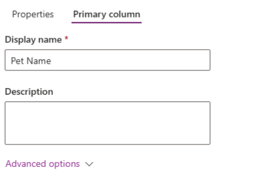

---
lab:
  title: "Labo\_2\_: Modèle de données"
  module: 'Module 2: Get started with Microsoft Dataverse'
---

# Labo pratique 2 – Modèle de données

Dans ce labo, vous allez créer des tables et des colonnes Dataverse.

## Contenu du didacticiel

- Comment créer des tables et des colonnes dans Microsoft Dataverse
- Comment créer une relation avec une colonne de recherche

## Étapes de labo de haut niveau

- Créer une table personnalisée
- Ajouter des colonnes à la table
- Créer une relation en utilisant une colonne de recherche
  
## Prérequis

- Vous devez avoir effectué **Labo 0 : Valider l’environnement de labo**

## Procédure détaillée

## Exercice 1 – Créer des tables personnalisées

### Tâche 1.1 – Créer la table Booking Request (Demande de réservation)

1. Accédez au portail Power Apps Maker <https://make.powerapps.com>.

1. Vérifiez que vous êtes dans l’environnement **Dev One**.

1. Dans le volet de navigation de gauche, sélectionnez **Tables**.

1. Sélectionnez **+ Nouvelle table**, puis sélectionnez **Ajouter des colonnes et des données**.

    

1. Sélectionnez l’icône de **crayon** en regard de Nouvelle table.

    

1. Entrez `Booking Request` comme **Nom d’affichage**.

1. Sélectionnez **Enregistrer**.

### Tâche 1.2 – Colonne principale

1. Sélectionnez le caret déroulant en regard de **Nouvelle colonne**, puis sélectionnez **Modifier la colonne**.

    

1. Entrez `Pet Name` comme **Nom d’affichage**.

1. Sélectionnez **Mettre à jour**.

1. Sélectionnez **Créer**.

### Tâche 1.3 – Ajouter des colonnes

1. Dans le volet **Colonnes et données de Booking Request**, sélectionnez **+** pour ajouter une nouvelle colonne.

    

1. Dans le volet **Nouvelle colonne**, entrez ou sélectionnez les valeurs suivantes :

   1. Nom d’affichage : `Owner Name`
   1. Type de données : **Ligne de texte unique**
   1. Obligatoire : **Contrainte obligatoire**

    

1. Sélectionnez **Enregistrer**.

1. Dans le volet **Colonnes et données de Booking Request**, sélectionnez **+** pour ajouter une nouvelle colonne.

1. Dans le volet **Nouvelle colonne**, entrez ou sélectionnez les valeurs suivantes :

   1. Nom d’affichage : `Owner Email`
   1. Type de données : **Ligne de texte unique**
   1. Format: **E-mail**
   1. Obligatoire : **Contrainte obligatoire**

1. Sélectionnez **Enregistrer**.

1. Dans le volet **Colonnes et données de Booking Request**, sélectionnez **+** puis, dans le volet **Nouvelle colonne**, entrez ou sélectionnez les valeurs suivantes :

   1. Nom d’affichage : `Start Date`
   1. Type de données : **Date et heure**
   1. Obligatoire : **Contrainte obligatoire**

1. Sélectionnez **Enregistrer**.

1. Dans le volet **Colonnes et données de Booking Request**, sélectionnez **+** puis, dans le volet **Nouvelle colonne**, entrez ou sélectionnez les valeurs suivantes :

   1. Nom d’affichage : `End Date`
   1. Type de données : **Date et heure**
   1. Obligatoire : **Facultatif**

1. Sélectionnez **Enregistrer**.

1. Dans le volet **Colonnes et données de Booking Request**, sélectionnez **+** puis, dans le volet **Nouvelle colonne**, entrez ou sélectionnez les valeurs suivantes :

   1. Nom d’affichage : `Cost`
   1. Type de données : **Devise**
   1. Obligatoire : **Facultatif**

1. Sélectionnez **Enregistrer**.

1. Dans le volet **Colonnes et données de Booking Request**, sélectionnez **+** puis, dans le volet **Nouvelle colonne**, entrez ou sélectionnez les valeurs suivantes :

   1. Nom d’affichage : `Notes`
   1. Type de données : **Plusieurs lignes de texte**
   1. Format: **Texte**
   1. Obligatoire : **Facultatif**

### Tâche 1.4 – Ajouter une colonne de choix

1. Dans le volet **Colonnes et données de Booking Request**, sélectionnez **+** puis, dans le volet **Nouvelle colonne**, entrez ou sélectionnez les valeurs suivantes :

   1. Nom d’affichage : `Decision`
   1. Type de données : **Choix**
   1. Obligatoire : **Facultatif**

1. Sélectionnez **Non** pour **Synchroniser avec le choix global ?**

1. Entrez `Undecided` pour **Étiquette** et `1` pour **Valeur**.

1. Sélectionnez **+ Nouveau choix**, puis entrez `Accepted` pour **Étiquette** et `2` pour **Valeur**.

1. Sélectionnez **+ Nouveau choix**, puis entrez `Declined` pour **Étiquette** et `3` pour **Valeur**.

1. Sélectionnez **Undecided** (Indécis) pour **Choix par défaut**.

    

1. Sélectionnez **Enregistrer**.

## Exercice 2 – Créer une relation

### Tâche 2.1 – Créer une colonne de recherche

1. Accédez au portail Power Apps Maker <https://make.powerapps.com>.

1. Vérifiez que vous êtes dans l’environnement **Dev One**.

1. Dans le volet de navigation de gauche, sélectionnez **Tables**.

1. Dans le volet **Colonnes et données de Booking Request**, sélectionnez **+** puis, dans le volet **Nouvelle colonne**, entrez ou sélectionnez les valeurs suivantes :

   1. Nom d’affichage : `Account`
   1. Type de données : **Lookup**
   1. Obligatoire : **Facultatif**
   1. Table associée : **Compte**

    

1. Sélectionnez **Enregistrer**.
