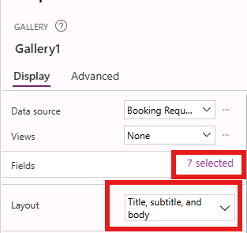

---
lab:
  title: "Labo 3\_: Créer une application de canevas"
  module: 'Module 3: Customize a canvas app in Power Apps'
---

# Labo de pratique 3 : Créer une application canevas

Dans ce labo, vous allez concevoir et créer une application canevas à partir de rien, ajouter une source de données et une galerie.

## Contenu du didacticiel

- Comment créer une application canevas avec une galerie liée à une source de données
- Comment mettre en forme des champs avec la formule Power Fx

## Étapes de labo de haut niveau

- Créer une application canevas à partir de zéro
- Ajouter une source de données à l’application
- Ajouter une galerie à l’application
- Configurer les champs dans la galerie
  
## Prérequis

- Doit avoir complété le **Labo 2 : Modèle de données**

## Procédure détaillée

## Exercice 1 : Créer une application canevas

### Tâche 1.1 : Créer l’application

1. Naviguer vers le portail Power Apps Maker <https://make.powerapps.com>.

1. Vérifiez que vous êtes dans l’environnement **Dev One**.

1. Sélectionner l’onglet **+ Créer** dans le menu de gauche.

1. Sélectionner la **vignette de l’application vide** sous **Démarrer depuis**.

    

1. Sélectionner **Créer** sous la vignette **application de canevas vide**.

1. Entrer `Booking Request app` pour le **Nom de l’application**.

1. Sélectionner **Tablette** pour **Format**.

    

1. Sélectionnez **Créer**.

1. Attendre que l’application soit générée.

1. Sélectionner **Enregistrer** en haut à droite de Power Apps Studio.

### Tâche 1.2 : Ajouter une source de données

1. Dans le menu de création d’applications, sélectionnez **Données**.

    

1. Sélectionner le menu déroulant en à côté d’**Ajouter des données** et entrer `Booking` dans **Rechercher**.

    

1. Sélectionner la table **Requêtes de réservation** Microsoft Dataverse.

### Tâche 1.3 : Configurer l’écran principal

1. Dans le menu création d’application, sélectionner **Arborescence**.

1. Sélectionner **Écran1** dans l’arborescence, puis sélectionner les points de suspension (**...**) et sélectionner **Renommer**.

1. Saisissez `MainScreen`.

1. Dans le menu de création d’application, sélectionner **Insérer (+)**.

1. Insérer un **Rectangle**.

1. Faire glisser le rectangle vers le haut à gauche de l’écran.

1. Dans le menu création d’application, sélectionner **Arborescence**.

1. Renommez le rectangle par `HeaderRect`.

1. Définir les propriétés de l’icône comme suit :

   1. X = `0`
   1. Y = `0`
   1. Hauteur = `80`
   1. Largeur = `Parent.Width`

1. Dans le menu de création d’application, sélectionner **Insérer (+)**.

1. Sélectionnez **Libellé de texte**.

1. Faire glisser l'étiquette vers le coin supérieur droit de l'écran.

1. Dans le menu création d’application, sélectionner **Arborescence**.

1. Donnez le nom `HeaderLabel` au contrôle Libellé de texte.

1. Définissez les propriétés de l'étiquette comme suit :

   1. X = `0`
   1. Y = `0`
   1. Hauteur = `80`
   1. Largeur = `Parent.Width`
   1. Aligner = `Align.Center`
   1. Taille = `24`
   1. Texte = `"Booking Request"`
   1. Couleur = `Color.White`

    

1. Sélectionner **Enregistrer** en haut à droite de Power Apps Studio.

### Tâche 1.4 : Ajouter une galerie

1. Dans le menu de création d’application, sélectionner **Insérer (+)**.

1. Sélectionnez **Galerie verticale**.

    

1. Sélectionner **Requêtes de réservation**.

    

1. Sélectionner **Titre, sous-titre et corps** comme **Disposition**.

1. Choisir **7 sélectionnés** à côté de **Champs**

1. Sélectionner **Coût** pour **Corps**.

1. Sélectionner **Décision** comme **Sous-titre**.

1. Sélectionner **Le nom de l’animal de compagnie** en tant que **Titre**.

    

1. Fermez le volet Données.

1. Dans le menu création d’application, sélectionner **Arborescence**.

1. Donnez le nom `BookingRequestList` à la galerie.

1. Définissez les propriétés de la galerie comme suit :

   1. X = `0`
   1. Y = `80`
   1. Hauteur = `575`
   1. Largeur = `250`

### Tâche 1.5 : Mettre en forme le champ des devises

1. Dans le menu création d’application, sélectionner **Arborescence**.

1. Développer la galerie.

1. Sélectionner le corps.

    

1. Définir la propriété **Texte** sur la formule suivante :

    ```powerappsfl
    Text(Value(ThisItem.Cost), "$#,##0.00")
    ```

1. Sélectionner **Enregistrer** en haut à droite de Power Apps Studio.

1. Sélectionner le bouton **<- Précédent** en haut à gauche de la barre de commandes, puis sélectionner **Quitter** pour quitter l’application.
