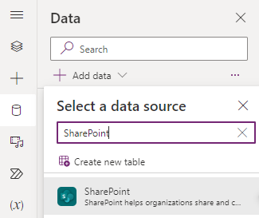
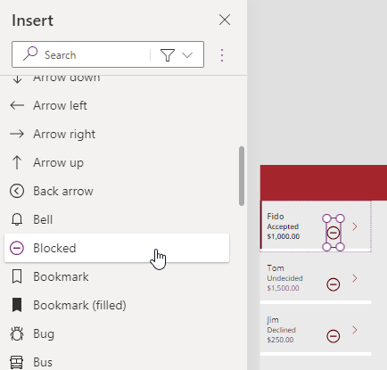

---
lab:
  title: "Labo\_5\_: Données externes"
  module: 'Module 5: Work with external data in a Power Apps canvas app'
---

# Labo pratique 5 : Données externes

Dans ce labo, vous allez ajouter une source de données externe.

## Contenu du didacticiel

- Comment ajouter une liste SharePoint à votre application canevas
- Comment utiliser des collections
- Comment utiliser Patch
- Comment utiliser le connecteur Office365Users

## Étapes de labo de haut niveau

- Créer une liste SharePoint
pour Bookings
- Ajouter la liste SharePoint en tant que galerie
- Stocker des enregistrements sélectionnés à partir d’une galerie
- Utiliser Patch pour définir la décision relative à une demande de réservation
- Utiliser le connecteur Office365User pour afficher les détails de l’utilisateur
  
## Prérequis

- Vous devez avoir terminé **Labo 4 : Générer l’interface utilisateur**

## Procédure détaillée

## Exercice 1 : Créer une liste SharePoint

### Tâche 1.1 Créer un site SharePoint

1. Dans le portail Power Apps Maker, `https://make.powerapps.com` sélectionnez le **Lanceur d’applications** en haut à gauche de la fenêtre du navigateur, puis sélectionnez **SharePoint**.

1. Si la boîte de dialogue contextuelle **Bienvenue dans la page de démarrage de SharePoint** s’affiche, sélectionnez **✖** pour fermer la boîte de dialogue.

1. Dans SharePoint, sélectionnez **+Créer un site**.

1. Sélectionnez **Site d’équipe**, sélectionnez le modèle **Équipe standard**, puis **Utiliser le modèle**.

1. Entrez `Pet boarding` comme **Nom du site** et sélectionnez **Suivant**.

1. Sélectionnez **Créer un site**.

1. Sélectionnez **Terminer**.

1. Si la boîte de dialogue contextuelle **Démarrer la conception de votre site** s’affiche, fermez la boîte de dialogue.


### Tâche 1.2 Créer une liste SharePoint

1. Dans le site SharePoint, sélectionnez **+ Nouveau**, puis **Liste**.

    

1. Sélectionnez **Liste vide**.

1. Entrez `Bookings` comme **Nom**, puis sélectionnez **Créer**.

1. Sélectionnez **+ Ajouter une colonne**, **Texte**, puis **Suivant**.

1. Dans le volet **Créer une colonne**, entrez ou sélectionnez les valeurs suivantes :

   1. Nom : `Pet Name`
   1. Type de données : **Ligne de texte unique**

1. Sélectionnez **Enregistrer**.

1. Sélectionnez **+ Ajouter une colonne**, **Texte**, puis **Suivant**.

1. Dans le volet **Créer une colonne**, entrez ou sélectionnez les valeurs suivantes :

   1. Nom : `Owner Name`
   1. Type de données : **Ligne de texte unique**

1. Sélectionnez **Enregistrer**.

1. Sélectionnez **+ Ajouter une colonne**, sélectionnez **date et heure**, puis **Suivant**.

1. Dans le volet **Créer une colonne**, entrez ou sélectionnez les valeurs suivantes :

   1. Nom : `Start Date`
   1. Type de données : **Date et heure**

1. Sélectionnez **Enregistrer**.

1. Sélectionnez **+ Ajouter une colonne**, sélectionnez **date et heure**, puis **Suivant**.

1. Dans le volet **Créer une colonne**, entrez ou sélectionnez les valeurs suivantes :

   1. Nom : `End Date`
   1. Type de données : **Date et heure**

1. Sélectionnez **Enregistrer**.

1. Copiez la première partie de l’URL du site SharePoint, par exemple `https://m365x99999999.sharepoint.com/sites/Petboarding/`


## Exercice 2 : Ajouter une liste SharePoint à l’application canevas

### Tâche 2.1 : Modifier l’application

1. Accédez au portail de création Power Apps `https://make.powerapps.com`

1. Vérifiez que vous êtes dans l’environnement **Dev One**.

1. Sélectionnez l’onglet **Applications** dans le menu de navigation de gauche.

1. Sélectionnez l’**application Booking Request**, sélectionnez les commandes (**...**), puis **Modifier > Modifier dans un nouvel onglet**.


### Tâche 2.2 : Ajouter SharePoint comme source de données

1. Dans le menu de création d’applications, sélectionnez **Données**.

1. Sélectionnez le menu déroulant en regard d’**Ajouter des données** et entrez `SharePoint` dans **Rechercher**.

    

1. Sélectionnez **SharePoint**.

1. Sélectionnez **Se connecter directement (services de cloud computing)**, puis **Se connecter**.

1. Entrez l’URL du site SharePoint que vous avez créé précédemment dans ce labo.

    

1. Sélectionnez **Se connecter**.

1. Sélectionnez **Bookings**.

    

1. Sélectionnez **Se connecter**.

### Tâche 2.3 : Ajouter une galerie pour la liste SharePoint

1. Dans le menu de création d’application, sélectionnez **Insérer (+)**.

1. Sélectionnez **Galerie verticale**.

1. Sélectionnez **Bookings** comme source de données.

1. Sélectionnez **Titre et sous-titre** comme **Disposition**.

1. Sélectionnez **6 sélectionnés** en regard de **Champs**.

1. Sélectionnez **Nom de l’animal de compagnie** pour **Titre3**.

1. Sélectionnez **Date de début** comme **Sous-titre3**.

1. Fermez le volet **Données**.

1. Dans le menu création d’application, sélectionner **Arborescence**.

1. Donnez le nom `BookingList` à la galerie.

1. Définissez les propriétés de la galerie dans la barre de formule de la façon suivante :

   1. X = `1000`
   1. Y = `80`
   1. Hauteur = `575`
   1. Largeur=`250`

## Exercice 3 : Collections

### Tâche 3.1 Créer une collection

1. Dans le menu de création d’application, sélectionnez **Arborescence**.

1. Développez **BookingRequestList**.

1. Sélectionnez **NextArrow**.

1. Définissez la propriété **OnSelect** de NextArrow dans la barre de formule sur :

    ```powerappsfl
    Collect(colRequests, ThisItem)
    ```

1. Dans le menu de création d’application, sélectionnez **Arborescence**.

1. Sélectionnez l’objet **App**.

1. Définissez la propriété **OnStart** dans la barre de formule sur :

    ```powerappsfl
    Clear(colRequests)
    ```

## Exercice 4 : Patch

### Tâche 4.1 Refuser la demande de réservation

1. Dans le menu de création d’application, sélectionnez **Arborescence**.

1. Sélectionnez **BookingRequestList**.

1. Sélectionnez l’icône de **crayon** en haut à gauche du contrôle de galerie.

    

1. Dans le menu de création d’application, sélectionnez **Insérer (+)**.

1. Développez **Icônes**.

1. Sélectionnez **Bloqué**. L’icône est ajoutée à chaque ligne de la galerie.

1. Définissez les propriétés de l’icône dans la barre de formule de la façon suivante :

   1. X = `150`
   1. Y = `40`
   1. Hauteur = `30`
   1. Largeur = `30`

    

1. Dans le menu création d’application, sélectionnez **Arborescence**.

1. Renommez l’icône comme suit : `DeclineIcon`.

1. Définissez la propriété **OnSelect** de **DeclineIcon** dans la barre de formule sur :

    ```powerappsfl
    Patch('Booking Requests', ThisItem, {Decision: 'Decision (Booking Requests)'.Declined})
    ```

## Exercice 5 : Utilisateurs d’Office 365

### Tâche 5.1 Ajouter Utilisateurs d’Office 365 comme source de données

1. Dans le menu de création d’applications, sélectionnez **Données**.

1. Sélectionnez le menu déroulant en regard d’**Ajouter des données** et entrez `Office 365` dans **Rechercher**.

1. Sélectionnez **Utilisateurs d’Office 365**.

1. Sélectionnez **Se connecter**.


### Tâche 5.2 Afficher le pays de l’utilisateur

1. Sélectionnez un emplacement en dehors de la galerie sur le canevas vide ou sélectionnez **MainScreen** sur l’**Arborescence**.

1. Dans le menu de création d’application, sélectionner **Insérer (+)**.

1. Sélectionnez **Libellé de texte**.

1. Faites glisser l’étiquette en haut à droite de l’écran en regard de UserLabel.

1. Dans le menu de création d’application, sélectionnez **Arborescence**.

1. Donnez le nom `UserDetailsLabel` au contrôle Libellé de texte.

1. Définissez la propriété **Text** de **UserDetailsLabel** dans la barre de formule sur :

    ```powerappsfl
    Office365Users.MyProfile().Country
    ```

1. Définissez les propriétés de l’étiquette dans la barre de formule de la façon suivante :

   1. X = `930`
   1. Y = `20`
   1. Taille = `18`
   1. Couleur = `Color.White`

1. Sélectionner **Enregistrer** en haut à droite de Power Apps Studio.

1. Sélectionner le bouton **<- Précédent** en haut à gauche de la barre de commandes, puis sélectionner **Quitter** pour quitter l’application.

