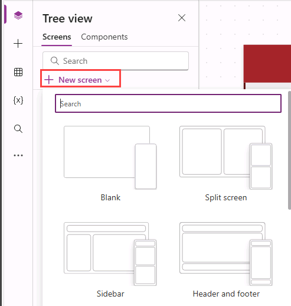

---
lab:
  title: "Labo\_6\_: Forms"
  module: 'Module 6: Write data in a Power Apps canvas app'
---

# Exercice pratique du Labo 6 : formulaires

Dans ce labo, vous allez utiliser des formulaires pour créer et modifier des enregistrements dans une source de données.

## Contenu du didacticiel

- Comment ajouter des écrans
- Comment naviguer d’un écran à un autre
- Comment utiliser un formulaire pour créer un enregistrement dans une source de données
- Comment utiliser un formulaire pour modifier un enregistrement dans une source de données
- Comment supprimer un enregistrement dans une source de données
- Comment lier un formulaire à une galerie

## Étapes de labo de haut niveau

- Créer des écrans
- Accéder à un écran lorsqu’un enregistrement est sélectionné dans une galerie
- Naviguer d’un écran à un autre
- Afficher un enregistrement avec un formulaire
- Supprimer un enregistrement
- Modifier un enregistrement avec un formulaire
- Créer un enregistrement avec un formulaire
  
## Prérequis

- Vous devez avoir terminé **Labo 5 : Données externes**

## Procédure détaillée

## Exercice 1 : ajouter des écrans et la navigation

### Tâche 1.1 : modifier l’application

1. Accédez au portail Power Apps Maker <https://make.powerapps.com>.

1. Vérifiez que vous êtes dans l’environnement **Dev One**.

1. Sélectionnez l’onglet **Applications** dans le menu de gauche.

1. Sélectionnez l’application **Demande de réservation**, sélectionnez les commandes ( **...**), puis choisissez **Modifier > Modifier dans un nouvel onglet**.

### Tâche 1.2 : ajouter des écrans

1. Dans le menu création d’application, sélectionnez **Arborescence**.

1. Dans la barre d’actions de Power Apps Studio, sélectionnez **Nouvel écran**.

    

1. Sélectionnez **Vierge**.

1. Redéfinissez le nom de l’écran sur `EditScreen`.

1. Dans la barre d’actions de Power Apps Studio, sélectionnez **Nouvel écran**.

1. Sélectionnez **En-tête et pied de page**.

1. Redéfinissez le nom de l’écran sur `DetailScreen`.

### Étape 1.3 : ajouter la navigation

1. Sélectionnez **NextArrow** dans **BookingRequestList** dans **MainScreen**.

1. Définissez la propriété **OnSelect** de NextArrow sur :

    ```powerappsfl
    Collect(colRequests, ThisItem);Navigate(DetailScreen, ScreenTransition.Cover);
    ```

1. Sélectionnez **EditScreen**.

1. Dans le menu de création d’application, sélectionnez **Insérer (+)**.

1. Développez les **icônes**.

1. Sélectionnez **Flèche Retour**.

1. Définissez la propriété **OnSelect** de l’icône sur :

    ```powerappsfl
    Back()
    ```

1. Dans l’**arborescence**, sélectionnez l’icône, puis les commandes (**...**) et choisissez **Copier**.

1. Développez **DetailScreen**.

1. Sélectionnez **HeaderContainer**, puis les commandes (**...**) et **collez**.

## Exercice 2 : écran Détails

### Tâche 2.1 : ajouter un formulaire d’affichage

1. Dans le menu création d’application, sélectionnez **Arborescence**.

1. Développez **DetailScreen**.

1. Développez **ScreenContainer**.

1. Sélectionnez **MainContainer**.

1. Dans le menu de création d’application, sélectionnez **Insérer (+)**.

1. Développez **Entrée**.

1. Sélectionnez **Afficher le formulaire**.

    

1. Dans les propriétés de FormViewer, sélectionnez **Demandes de réservation** pour**Source de données**.

1. Choisissez **2 sélectionnés** en regard de **Champs**.

    

1. Supprimez **Créé le** en sélectionnant les points de suspension (**...**) en regard du champ et en sélectionnant **Supprimer**.

1. Cliquez sur **+Ajouter un champ** et sélectionnez les champs suivants :

   1. Coûts
   1. Décision
   1. Date de fin
   1. Adresse e-mail du propriétaire
   1. Nom du propriétaire
   1. Date de début

    

1. Sélectionnez **Ajouter**.

1. Faites glisser les champs dans l’ordre suivant :

   1. Nom de l’animal
   1. Nom du propriétaire
   1. Adresse e-mail du propriétaire
   1. Date de début
   1. Date de fin
   1. Décision
   1. Coûts

    

1. **Fermez** le volet **Champs**.

1. Définissez la propriété **Élément** du contrôle de visionneuse de formulaire sur :

    ```powerappsfl
    BookingRequestList.Selected
    ```

### Tâche 2.2 : ajouter une étiquette

1. Dans le menu création d’application, sélectionnez **Arborescence**.

1. Développez **DetailScreen**.

1. Développez **ScreenContainer**.

1. Sélectionnez **FooterContainer**.

1. Sélectionnez **+** dans le conteneur Pied de page.

    

1. Sélectionnez **Étiquette de texte**

1. Définissez la propriété **Texte** de l’étiquette sur :

    ```powerappsfl
    BookingRequestList.Selected.'Pet Name'
    ```

### Tâche 2.3 : ajouter un bouton Supprimer

1. Dans le menu création d’application, sélectionnez **Arborescence**.

1. Développez **DetailScreen**.

1. Développez **ScreenContainer**.

1. Sélectionnez **FooterContainer**.

1. Dans le menu de création d’application, sélectionnez **Insérer (+)**.

1. Sélectionnez **Bouton**.

1. Dans le menu création d’application, sélectionnez **Arborescence**.

1. Renommez le bouton comme suit : `Deletebtn`.

1. Modifiez la propriété **Texte** du bouton en :

    ```powerappsfl
    "Delete"
    ```

1. Définissez la propriété **OnSelect** du contrôle Bouton de succès sur :

    ```powerappsfl
    Remove('Booking Requests', BookingRequestList.Selected); Back();
    ```

## Exercice 3 : écran Modifier

### Tâche 3.1 : ajouter un formulaire de modification

1. Dans le menu création d’application, sélectionnez **Arborescence**.

1. Sélectionnez **EditScreen**.

1. Dans le menu de création d’application, sélectionnez **Insérer (+)**.

1. Sélectionnez **Modifier le formulaire**.

1. Dans les propriétés du formulaire, sélectionnez **Demandes de réservation** pour la **source de données**.

1. Choisissez **2 sélectionnés** en regard de **Champs**.

1. Supprimez **Créé le** en sélectionnant les points de suspension (**...**) en regard du champ et en sélectionnant **Supprimer**.

1. Cliquez sur **+Ajouter un champ** et sélectionnez les champs suivants :

   1. Coûts
   1. Date de fin
   1. Adresse e-mail du propriétaire
   1. Nom du propriétaire
   1. Date de début

1. Sélectionnez **Ajouter**.

1. Faites glisser les champs dans l’ordre suivant :

   1. Nom de l’animal
   1. Nom du propriétaire
   1. Adresse e-mail du propriétaire
   1. Date de début
   1. Date de fin
   1. Coûts

1. **Fermez** le volet **Champs**.

1. Définissez la propriété **Élément** du contrôle de formulaire sur :

    ```powerappsfl
    BookingRequestList.Selected
    ```

1. Dans le menu création d’application, sélectionnez **Arborescence**.

1. Renommez le formulaire comme suit : `BookingRequestForm`.

1. Définissez les propriétés du formulaire comme suit :

   1. X = `0`
   1. Y = `125`
   1. Hauteur = `500`
   1. Largeur = `Parent.Width`
   1. Colonnes = `1`
   1. Disposition = `Horizontal`

    

### Tâche 3.2 : ajouter un bouton Envoyer

1. Dans le menu création d’application, sélectionnez **Arborescence**.

1. Sélectionnez **EditScreen**.

1. Dans le menu de création d’application, sélectionnez **Insérer (+)**.

1. Sélectionnez **Bouton**.

1. Faites glisser le bouton sous le formulaire.

1. Dans le menu création d’application, sélectionnez **Arborescence**.

1. Renommez le bouton comme suit : `Submitbtn`.

1. Modifiez la propriété **Texte** du bouton en :

    ```powerappsfl
    "Submit"
    ```

1. Définissez la propriété **OnSelect** du contrôle Bouton de succès sur :

    ```powerappsfl
    SubmitForm(BookingRequestForm)
    ```

1. Sélectionnez **BookingRequestForm**.

1. Définissez la propriété **OnSuccess** du bouton sur :

    ```powerappsfl
    Navigate(MainScreen, ScreenTransition.UnCover)
    ```

### Tâche 3.3 : ajouter la navigation à l’écran de modification

1. Dans le menu création d’application, sélectionnez **Arborescence**.

1. Développez **DetailScreen**.

1. Développez **ScreenContainer**.

1. Sélectionnez **HeaderContainer**.

1. Dans le menu de création d’application, sélectionnez **Insérer (+)**.

1. Développez les **icônes**.

1. Sélectionnez **Modifier**.

1. Dans le menu création d’application, sélectionnez **Arborescence**.

1. Renommez l’icône comme suit : `EditIcon`.

1. Définissez la propriété **OnSelect** de l’icône sur :

    ```powerappsfl
    Navigate(EditScreen, ScreenTransition.Cover)
    ```

### Tâche 3.4 : nouvel enregistrement

1. Dans le menu création d’application, sélectionnez **Arborescence**.

1. Sélectionnez **MainScreen**.

1. Dans le menu de création d’application, sélectionnez **Insérer (+)**.

1. Développez les **icônes**.

1. Sélectionnez **Ajouter**.

1. Dans le menu création d’application, sélectionnez **Arborescence**.

1. Renommez l’icône comme suit : `NewIcon`.

1. Définissez les propriétés de l’icône comme suit :

   1. X = `0`
   1. Y = `0`
   1. Hauteur = `80`
   1. Largeur = `80`
   1. Couleur = `Color.White`

1. Définissez la propriété **OnSelect** de l’icône sur :

    ```powerappsfl
    NewForm(BookingRequestForm);Navigate(EditScreen, ScreenTransition.Cover)
    ```

1. Sélectionnez **Enregistrer** en haut à droite de Power Apps Studio.

1. Sélectionnez le bouton **<- Précédent** en haut à gauche de la barre de commandes, puis cliquez sur **Quitter** pour quitter l’application.
